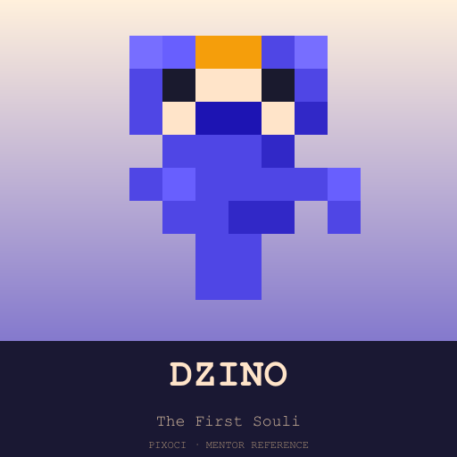
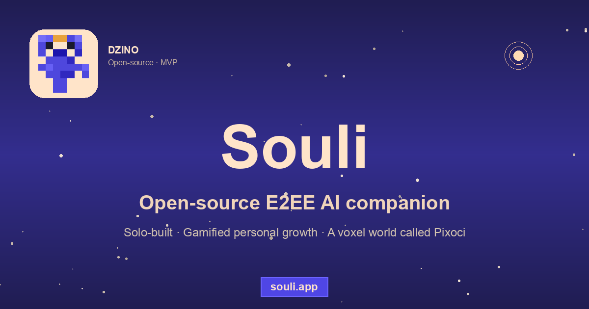

<div align="center">
  

# Souli

### An AI companion that knows you — and that you actually own.

End-to-end encrypted. Open-source. A voxel-fantasy world called **Pixoci** lives behind it, and a 13-episode story explains why.

[**souli.app**](https://souli.app) · [Story](https://souli.app/en/pribeh) · [Production gallery](https://souli.app/en/pribeh/assets) · [Issues](https://github.com/dzino-app/dzino/issues)

</div>

---

## Why this exists

Every AI companion you can sign up for today is a *rental*. Your memories, your moods, your goals — they live on someone else's server, behind someone else's TOS, and they vanish the day the company pivots or shuts down.

Souli is the opposite. Your Souli is a small, growing creature with a soul file you can actually read — eleven plain-text markdown files containing everything it knows about you. Encrypted in your browser before it ever leaves your device. The server stores ciphertext; even a stolen database backup reveals nothing.

It is half companion app, half art project. The world your Souli comes from — **Pixoci** — is canon, with a 13-episode origin story (in 9 languages) that ships with the app.

## How it works (the E2EE-with-LLM part)

The hard part of E2EE in an AI app is that the LLM needs to *read* your data to be useful — which seems to break encryption end-to-end. Souli's answer:

1. **Wrapping not raw encryption.** A master key (random 256-bit AES-GCM) is generated at signup, wrapped under the user's password (PBKDF2 600K iterations → AES-KW) *and* under a BIP39 recovery phrase. Both wraps are stored server-side; the master key itself never leaves the client.
2. **Soul files encrypted in the browser** before upload. The server only ever stores ciphertext + IV.
3. **LLM calls happen client-side-orchestrated.** When you chat, your client decrypts the relevant soul files, sends them with the user message to the model provider through our serverless function (which acts as an authenticated transit layer, not a data store). Nothing persists server-side except encrypted blobs.
4. **The server never sees plaintext.** A database dump, a backup tape, a stolen `.env` — none of them reveal anything. The model provider sees individual conversation payloads, but doesn't accumulate the corpus.
5. **Verifiable.** The crypto code lives in five small files with zero external dependencies (pure Web Crypto API). They are listed below — read them.

This is not theoretical Signal Protocol. It is the smallest thing that makes the model useful while keeping the long-term corpus encrypted.

## See it

<!--
  When the demo.gif is recorded, replace this  with:
    
  Recommended: 6-second tour — Home (Dzino animating) → click Príbeh →
  episode list → click E01 → story page renders. Record with Kap at 1280×720,
  export as GIF at 12fps, drop at app/public/readme/demo.gif.
-->


- **Live app:** [souli.app](https://souli.app) — the real thing
- **Voxel avatar art:** every Souli is procedurally drawn at runtime by `src/lib/pixel-art.ts` — try the [Pixoci library](https://souli.app/en/kniznica) to meet the seed mentors
- **The story:** [souli.app/en/pribeh](https://souli.app/en/pribeh) — 13-episode Pixoci origin story, 9 locales, with production storyboards and a brand chime

## Tech stack

- **Frontend:** Next.js 15 (App Router) · React 18 · Tailwind · TypeScript · next-intl (9 locales: sk, en, cs, de, es, fr, hi, hu, pl)
- **Backend:** Vercel Fluid Compute · Supabase (Auth + Postgres + Storage)
- **LLM:** Google Gemini 2.5 Flash via `@google/genai`, with BYOK support for OpenAI / Anthropic
- **Voice:** Google Cloud Text-to-Speech (paid tier) + Web Speech API fallback
- **3D / AR:** Three.js (WebXR)
- **Crypto:** pure Web Crypto API — AES-GCM 256 + PBKDF2 + AES-KW + BIP39
- **Build:** Bun · reproducible from `bun install --frozen-lockfile`

## Status

**Alpha.** [souli.app](https://souli.app) is live and the canonical story shipped in v1.11.0 (9 locales, 13 episodes, 13 storyboards), but this is still an indie project with ~5 users. Things break, the brand evolves, and you'll see the edges. Ideal for: people who want to read the source of their AI companion, contribute to the world, or follow the production of a voxel-fantasy series end-to-end.

## Verify the crypto module

Zero external dependencies. Pure Web Crypto API:

```
app/src/lib/crypto.ts          # AES-GCM 256 + PBKDF2
app/src/lib/crypto-keys.ts     # Master key wrap/unwrap (AES-KW)
app/src/lib/crypto-session.ts  # Session key lifecycle
app/src/lib/bip39.ts           # Recovery phrase generation
app/src/lib/bip39-wordlist.ts  # Standard BIP39 English wordlist
```

`grep -rE "fetch|XMLHttpRequest|import" app/src/lib/crypto*.ts app/src/lib/bip39*.ts` should show only ES-module imports and zero network calls.

## Reproducible build

```bash
# Prerequisites: Bun 1.2+, Node 24+
bun install --frozen-lockfile
cd app && bun run build
```

The build output in `app/.next/` should match what Vercel serves. To verify:

```bash
sha256sum app/.next/BUILD_ID
# Compare with https://souli.app/_next/BUILD_ID
```

## Develop

```bash
cd app
bun run dev         # http://localhost:3000
bun run typecheck   # TypeScript
bun run lint        # ESLint
bun run test        # Bun test runner
```

The story content lives at `app/content/story/{locale}/` (135 markdown files, 9 locales) and is inlined into a generated TS module at build time — see `app/scripts/build-story.ts`.

The mentor anchor art is rendered from the app's own `generateCharacter` function — `app/scripts/render-mentors.ts` produces 13 character sheets that match exactly what users see in `/kniznica`.

## Contribute

Issues and PRs welcome. The story has 8 non-Slovak locales that would benefit from native-speaker passes — see `app/content/story/{cs,de,es,fr,hi,hu,pl}/`. Style anchors at `app/public/style-anchors/` are placeholders; a hand-painter could level-up the entire production pipeline by replacing them — see [issue #50](https://github.com/dzino-app/dzino/issues/50).

If you're building anything in the "AI companion you actually own" space, I'd love to hear about it.

## License

[AGPL-3.0](LICENSE). If you ship a network service using this code, your modifications stay open under the same terms. This is intentional — the whole point is that your AI companion's source is readable. Commercial forks that close the source defeat that.

---

<sub>Built by Maros Janco. The character Dzino was the first Souli; everything else followed.</sub>
